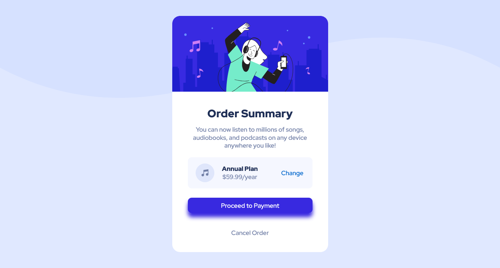
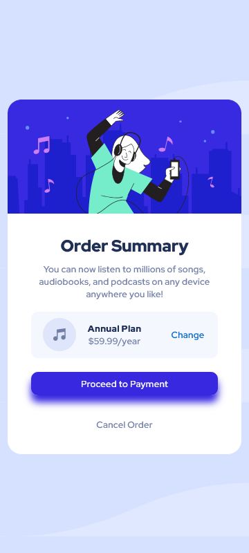

# Frontend Mentor - Order summary card solution

This is a solution to the [Order summary card challenge on Frontend Mentor](https://www.frontendmentor.io/challenges/order-summary-component-QlPmajDUj). Frontend Mentor challenges help you improve your coding skills by building realistic projects. 

## Table of contents

- [Overview](#overview)
  - [The challenge](#the-challenge)
  - [Screenshot](#screenshot)
  - [Links](#links)
- [My process](#my-process)
  - [Built with](#built-with)
  - [What I learned](#what-i-learned)
- [Author](#author)

## Overview

### The challenge

Users should be able to:

- See a beautiful UI on the website.
- The website is also mobile friendly, user can also view it on mobile without any problem.

### Screenshot




### Links

- Solution URL: [Add solution URL here](https://your-solution-url.com)
- Live Site URL: [Add live site URL here](https://your-live-site-url.com)

## My process

### Built with

- Semantic HTML5 markup
- CSS custom properties
- Flexbox

### What I learned

This is my first challenge and I have learnt many things. I have learnt how to use flexbox within the divs properly, and which properties of flex box to use at what time. Moreover arranging the items was a difficult thing for me, so I learnt that also.

Some of the mentions of my code to which I am happy I did myselves:

```html
<div class="annual-plan">
            <div class="content-padding">
              
              <div class="content-2">
                <p class="💪">Annual Plan</p>
                <p>$59.99/year</p>
              </div>
            </div>
            <div class="change"><a href="#">Change</a></div>
          </div>
```
```css
.change {
    display: flex;
    justify-content: flex-start;
    width: 5rem;
}
```
## Author

- Frontend Mentor - [PriyanshuSaxena2612](https://www.frontendmentor.io/profile/PriyanshuSaxena2612)
- Twitter - [Priyanshu_1310](https://www.twitter.com/Priyanshu_1310)
- Solution - [Solution](https://priyanshusaxena2612.github.io/Frontend-Challenge-1/)